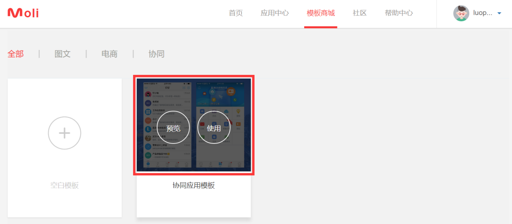
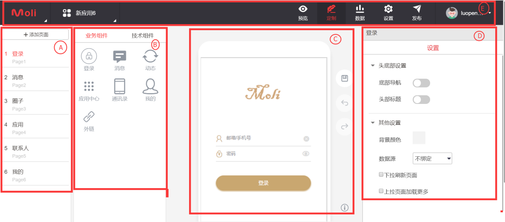

# 使用应用模板

用户创建app应用最快捷的方式是使用系统预制的模板。 将鼠标移到到应用模板界面， 选择预览或者使用该模板。

*	应用模板预览
点击预览按钮， 在弹出的页面中， 用户可用通过扫描二维码在移动端进行应用模板预览。
*	应用模板使用
点击使用按钮， 将弹出app应用定制界面。 用户可用通过简单的拖拽的方式实现复杂的app应用。移动智能云服务平台能够帮助用户实现app代码和发布。

在应用创建界面可用划分为A, B, C, D, E五个区域。 这五个区域分别是：  
A）	页面区：显示该应用最终由那些页面组成。   并能够在该区域内实现对页面的添加、编辑、修改、另存为和删除操作。  
B）	组件区：显示的是该模板预制的业务组件和技术组件。   用户可用选择相应的组件， 拖拽到C区进行展现和修改。  
C）	编辑区：为用户的主工作区，   用户能够实现对该app应用的详细的设计和修改。 提供了保存和回退的功能。  
D）	设置区： 用户对页面的组件进行个性化的设置和修改。 Moli移动智能云服务平台提供了可视化的编辑界面。用户能够非常方便的进行修改。   
E）	导航区：能够引导用户进入相应的功能页面， 能够实时预览、定制、数据管理、设置应用和发布应用。 
