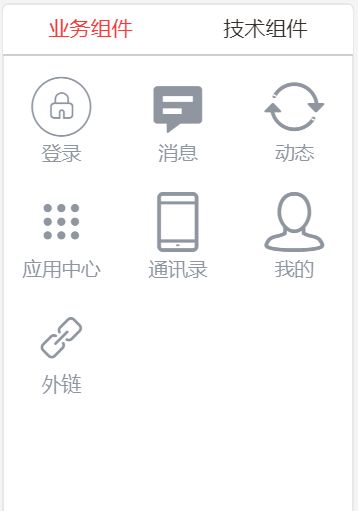
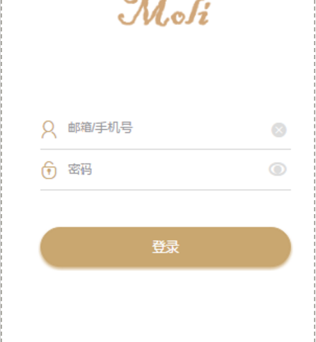
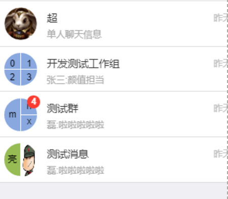
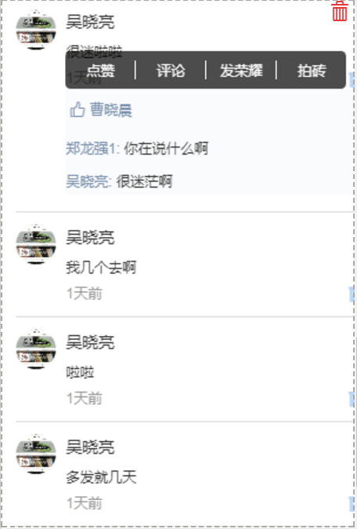
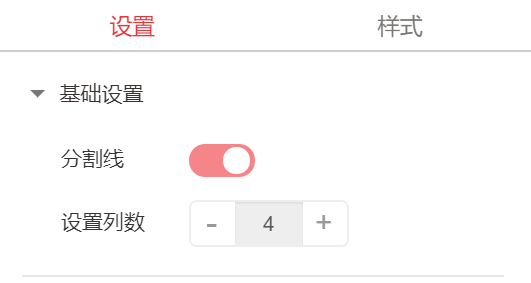
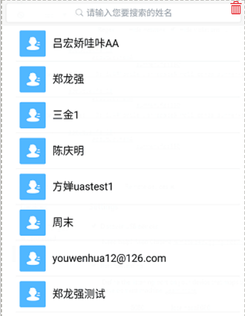
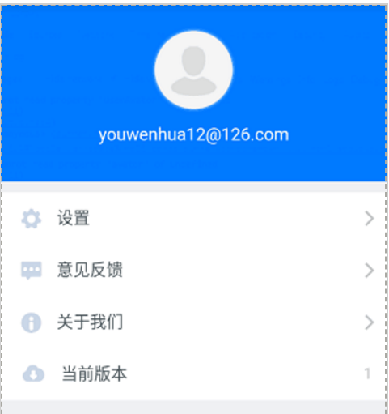
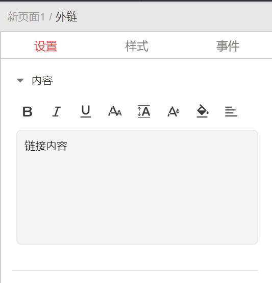

# 应用创建组件

Moli移动智能云服务平台为用户提供了丰富的业务组件和技术组件。 

用户可用将组件直接拖拽到右侧的编辑区。 Moli移动智能云服务平台对每个组件都进行了设计。

a)	登录组件

登录组件能够方便的为用户提供登录功能。 能够对登录组件的数据源和内容进行设置。 用户同时能够对登录组件的式样进行设置。 

b)	消息组件

移动智能云服务平台提供的消息组件能够方便用户实现消息的发送和管理功能。 同时提供给客户对消息组件的设置。 在右侧的设置区能够方便的设置消息组件的数据源和式样。

c)	动态组件

Moli提供动态组件如下图

d)	应用中心

Moli提供的应用中心组件如下图。能够对应用中心组件进行基础设置。

e)	通讯录

移动智能云服务平台提供的通讯录组件能够提供人员列表。 

f)	我的

移动智能云服务平台提供我的组件。 能够对app的个人信息进行设置和管理。

g)	外链

移动智能云服务平台提供的外链组件能够方便的用户设置外部链接。 用户方便的设置链接内容和、样式和触发事件。 

h)	Moli助手

Moli智能助手能够响应用户的输入， 提供智能帮助。 

